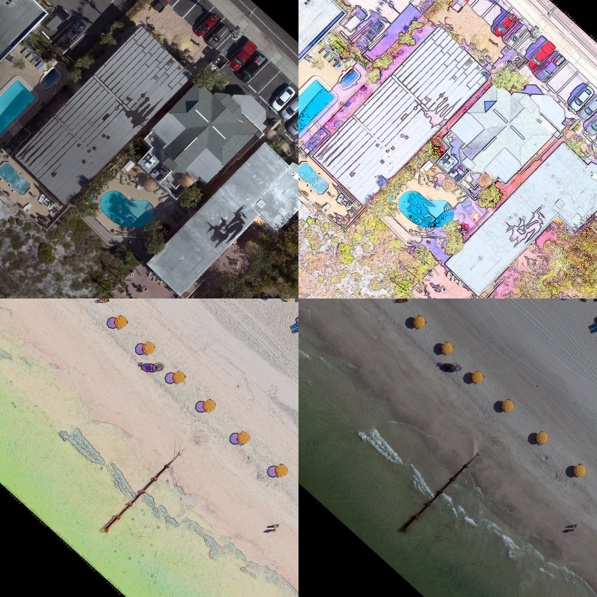

# "PBR" filter
{P}ansharpening by {B}ackground {R}emoval algorithm for sharpening RGB images

1. Read image, wavelet denoise, and convert to HSV
2. Do 'inverted background subtraction' on the V (intensity) channel
3. combine with HS, convert to RGB

The effect is to sharpen details of object boundaries/transitions, brighten, and recolour

But without changing the overall distribution of values within the image (i.e. the range), and recolouring in an internally consistent (deterministic) way

Sample 'Madeira' imagery comes from https://coastal.er.usgs.gov/data-release/doi-P9L474WC/

Sample 'OBX' imagery comes from https://www.sciencebase.gov/catalog/item/6037cca0d34eb12031175133

0. Create a conda environment

A. Conda housekeeping

`conda clean --all`
`conda update -n base -c defaults conda`

B. Create new `pbr` conda environment

We'll create a new conda environment and install packages into it from conda-forge

`conda env create -f install/pbr.yml`
`conda activate pbr`

1. Run the program

`python PBR_filter.py`

To get thicker dark lines use
`python PBR_filter.py  -r 5`

To get even thicker dark lines use something like
`python PBR_filter.py  -r 7`

If you want to print out two more plots showing the process step-by-step for each image, use :

`python PBR_filter.py -p 1`

navigate to a folder of images you wish to filter, and it will step through them one by one

2. Visualise your results
see the png images the program makes inside the same directory as the input images

## How does this work?

Let's take this image, which is a tile cropped out of a larger orthomosaic - see [here](https://coastal.er.usgs.gov/data-release/doi-P9L474WC/):
![][example/20180619_MadeiraBeachFL_ortho_5cm_10_12.jpg]

The filter with default radius of 3 pixels creates this PBR image
![][example/20180619_MadeiraBeachFL_ortho_5cm_10_12_filt.png]

In the figure below, the process is broken into stages
![][example/20180619_MadeiraBeachFL_ortho_5cm_10_12_filt_fig_breakdown.png]

a) original image
b) wavelet denoised image, where noise over a range of scales is removed and mostly affects very small scale (pixel level) noise. This step isnt crucial but I always like to denoise imagery if I can as a precaution
c) the greyscale background image that has been created with a rolling ball filter with ball of radius [whatever]
d) greyscale version of the denoised image
e) the intensity image that is the greyscale divided by the greyscale background image
f) the filtered RGB image that is the result of swapping the greyscale with the intensity image in the HSV stack of the original RGB image, then converting that into RGB colorspace

*disclaimer*: I do not know if I have reinvented the wheel - I have not searched for similar implementations. Please tell me by opening an Issue if this technique has previously been proposed
